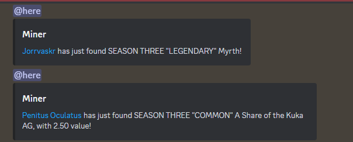
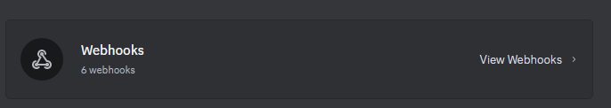

1. Go to any server that you own or have high permissions in and are willing to have a webhook post into.

2. Go to Server Settings, and under the Apps tab click Integrations.

3. Click

4. Click New Webhook, a new webhook will be created.

5. You can configure it however you want, but click Copy Webhook URL.

6. In the userscript, paste it in as the value of WEBHOOK_URL on line 11.

7. By default, it will ping @here unless you have your USER ID. To procure a user id, follow [these steps](https://support.discord.com/hc/en-us/articles/206346498-Where-can-I-find-my-User-Server-Message-ID), then paste it into username at line 12.

8. BY DEFAULT, cards with a mv of 1.5 prevent an autoclose. You can change this by changing the value at line 13.